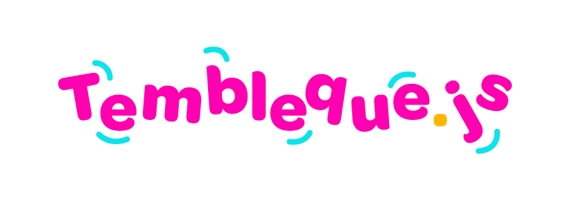

Tembleque.js is a simple JavaScript library that mimics React, Angular or Vue to use reactive template and bindings.

Check how it works [here](http://www.inerciabcn.com/misc/tembleque)

Run in Tembleque.js in a browser with: 

```bash
npx http-server
```

Or any other http web server. No dependencies or installation needed.